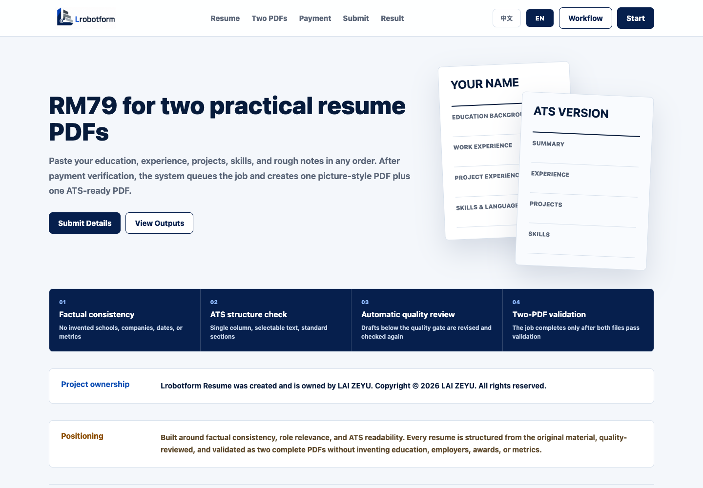
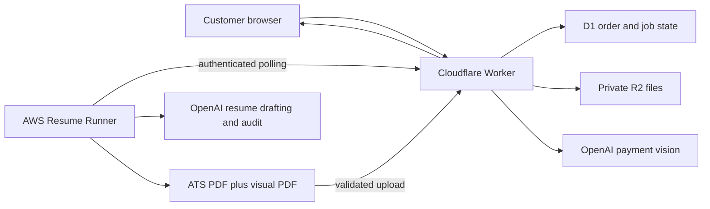

# Lrobotform Resume

> Created and owned by **LAI ZEYU**
> Copyright (c) 2026 LAI ZEYU. All rights reserved.

Lrobotform Resume is a bilingual, privacy-aware resume workflow that converts
verified source material into two deliverables:

- an ATS-ready, single-column PDF with selectable text;
- a visual PDF designed for direct human review.

The system combines a commercial frontend, Cloudflare Worker API, D1 order
state, private R2 file storage, OpenAI-assisted payment and content processing,
and a continuously running AWS job runner. An order is never marked complete
until both PDFs exist and the content quality gate passes.



## Portfolio Scope

This repository contains **only the Lrobotform Resume product**. The separate
Google Form project is intentionally excluded.

The public version also excludes all production credentials, bank details,
payment QR codes, customer records, uploaded receipts, and generated customer
resumes. Configuration examples contain placeholders only.

## What I Designed

LAI ZEYU defined the product requirements, workflow, quality standards,
architecture decisions, privacy boundaries, and final acceptance criteria.
Implementation was developed under LAI ZEYU's direction with AI-assisted
engineering tools.

Key product and engineering decisions include:

- two purpose-specific PDFs from one source submission;
- factuality checks that prohibit invented schools, employers, dates, awards,
  metrics, and qualifications;
- private payment-proof storage and strict file-signature validation;
- SHA-256 duplicate-proof blocking across all Resume orders;
- unguessable per-order access codes for status and downloads;
- separate administrator and AWS runner credentials;
- atomic job claiming, stale-job recovery, and automatic service restart;
- a hard completion gate requiring two valid PDFs and a passing quality report;
- bilingual Chinese and English interface text.

## Architecture



## Repository Layout

```text
public/          Product interface and bilingual client workflow
src/             Resume-only Cloudflare Worker API
migrations/      D1 schema for orders, jobs, events, and proof fingerprints
aws-runner/      AWS polling worker, PDF generation, and systemd service
docs/            Architecture and deployment documentation
.github/         CODEOWNERS and automated validation
```

## Security Model

1. The browser submits directly to the same-origin Worker.
2. Uploaded files are size-limited, MIME-checked, and signature-checked.
3. The proof is fingerprinted before storage; an existing hash is rejected.
4. OpenAI vision may approve a coherent receipt or route ambiguity to review.
5. Payment files and output PDFs remain private in R2.
6. Public status and download routes require a random per-order access code.
7. AWS and owner APIs use independent bearer secrets.
8. A job cannot become complete without two structurally valid PDFs and a
   passing quality result.

See [SECURITY.md](SECURITY.md) for reporting and production boundaries.

## Local Validation

Requirements:

- Node.js 20 or later
- Python 3.10 or later
- Cloudflare Wrangler

```bash
npm install
npm test
```

For local API development, copy `.dev.vars.example` to `.dev.vars`, create a
local D1 database, and apply the migration:

```bash
npm run db:migrate:local
npm run dev
```

Never commit `.dev.vars`, `.env`, API keys, customer materials, or payment
proofs. The ignore rules block these common secret and data paths.

## Deployment

Deployment needs a Cloudflare Worker, D1 database, private R2 bucket, and an
Ubuntu server for the Resume runner. Replace the placeholder resource IDs in
`wrangler.jsonc`, configure secrets through the provider dashboards or secret
stores, then follow [docs/deployment.md](docs/deployment.md).

## Ownership

Repository metadata, commit authorship, package metadata, CODEOWNERS,
`CITATION.cff`, and the visible product footer identify **LAI ZEYU** as the
project owner and creator. See [PROJECT_OWNERSHIP.md](PROJECT_OWNERSHIP.md).

This is a source-available portfolio repository, not an open-source project.
See [LICENSE](LICENSE) before using any part of it.
