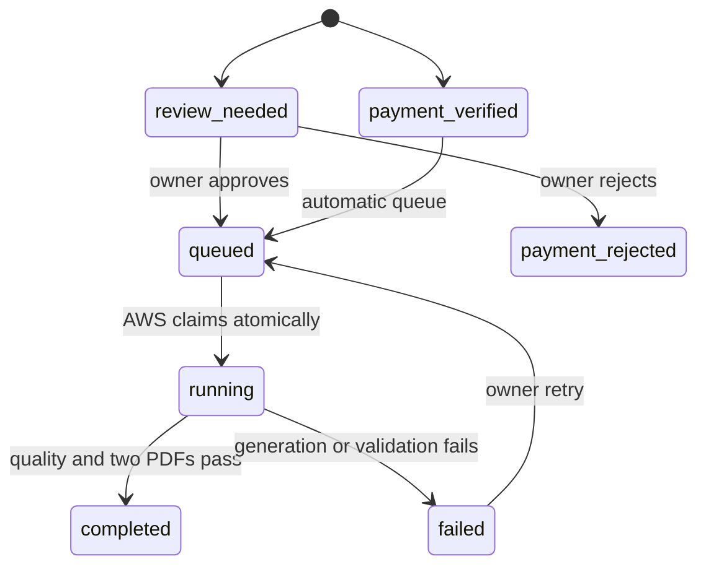

# Architecture

## Design Goal

Lrobotform Resume separates customer interaction, private order state, payment
evidence, and compute-heavy PDF generation. The browser never receives service
credentials and the AWS runner never accesses the database or storage directly.

## Components

### Product Interface

The static bilingual interface collects contact details, target role, source
material, output language, acknowledgements, and a payment proof. It also
stores the returned order access code locally for status polling.

### Cloudflare Worker

The Resume-only Worker owns the public API boundary. It validates submissions,
fingerprints proofs, stores private files, requests vision analysis, persists
order state, queues jobs, authorizes the runner, validates both returned PDFs,
and serves protected downloads.

### D1

D1 stores four data groups:

- `resume_orders`: customer request and payment decision;
- `resume_jobs`: queue, attempts, result, and output object keys;
- `resume_events`: append-only operational history;
- `payment_proof_fingerprints`: global Resume proof deduplication.

### R2

R2 stores payment proofs and generated PDFs. The bucket is private; files are
available only through authenticated or per-order access-controlled Worker
routes.

### AWS Runner

The runner long-polls for one queued job, runs drafting and factuality review,
scores deterministic quality checks, creates both PDFs, validates each file,
and uploads them through the authenticated runner API. The systemd unit restarts
it automatically after a process or server restart.

## State Model

## Completion Invariant

`completed` is accepted only when:

1. the order payment is verified;
2. the runner reports a passing content quality result;
3. an ATS PDF exists and passes byte-level PDF validation;
4. a visual PDF exists and passes byte-level PDF validation.

This prevents a successful-looking status from being stored when the actual
deliverables are missing or incomplete.
